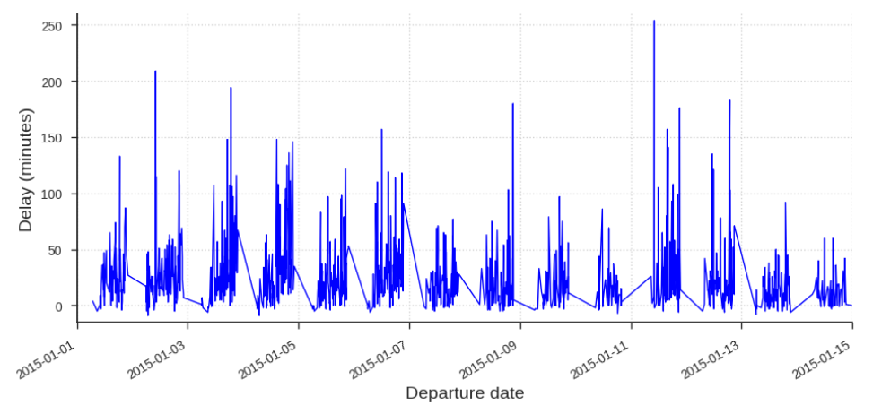
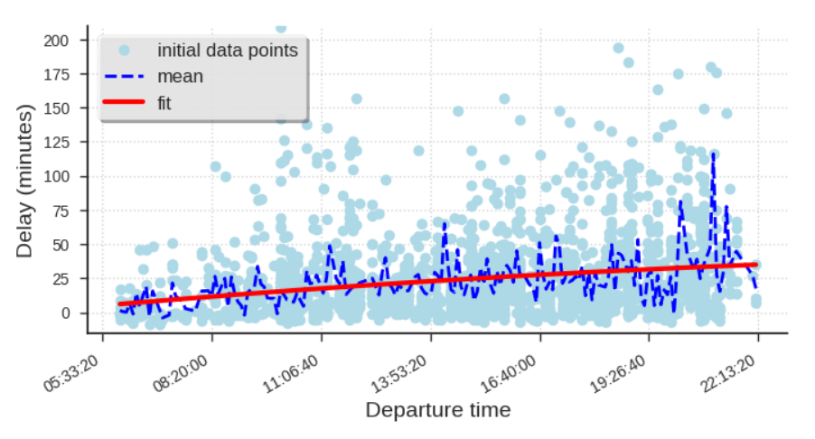
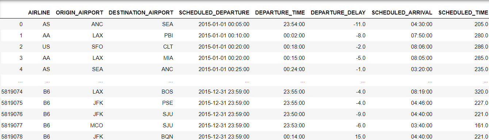
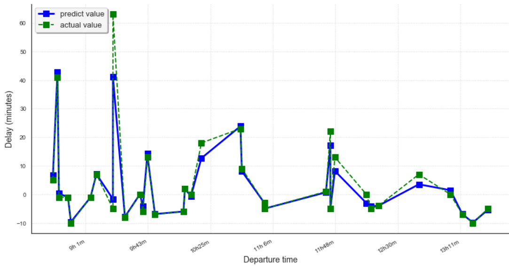

Предсказание задержек авиарейсов
================================
Рубцов Александр Павлович СУНЦ МГУ 11В класс
--------------------------------------------
### Введение
Перед автором стояла задача научиться предсказывать задержки рейсов на основании технических данных. Данная функция уже начала набирать свою популярность на платформе Google, что сподвигло разобраться и написать собственный проект этого назначения. Безусловно, возможность оценить на сколько могут задержать ваш рейс очень полезна, что являлось так же стимулом для создания этого проекта.  
### Постановка задачи и датасет
Датасет представляет из себя данные об 5 800 000 Американских рейсов за 2015 год. Все полеты описаны 31 характеристикой среди которых есть: 
***
- Запланированные дата и время вылета и фактическое время вылета
 ***
 - Аэропорт вылета и аэропорт прилета
 ***
 - Запланированное время прилета и фактическое время прилета 
 ***
 - Время задержки вылета и время задержки прилета
 ***
 - и т.д.
 ***
 
 При анализе характеристик можно сделать выводы, что многие из них не влияют на задержу рейса, а какие-то данные находятся не в самом удобном формате, по этому для построения модели были оставлены 8 характеристик.
 
 ### Методы
В начале были использованы две линейные регрессии на основе моделей:
***
- Один аэропорт и одна авиакомпания
***
- Одна авиакомпания и все аэропорты
***
Обе модели оказались не эффективными, т.к. использовали только малую часть данных и были не точны, но помогли разобраться с набором данных. А как итоговую модель было решено использовать случайный лес.
### Выводы и заключение
В итоге была получена модель, которая с небольшой погрешностью смогла предсказывать стандартные или не сильно большие задержки, что происходят в зависимости от времени отправки рейса или других повторяющихся факторов.
 
Для дальнейшего улучшения модели можно исследовать дополнительные факторы, которые могут повлиять на точность модели. Так же, можно расширить датасет авиакомпаниями разных государств, что приведет к большей области приминения этого проекта.
